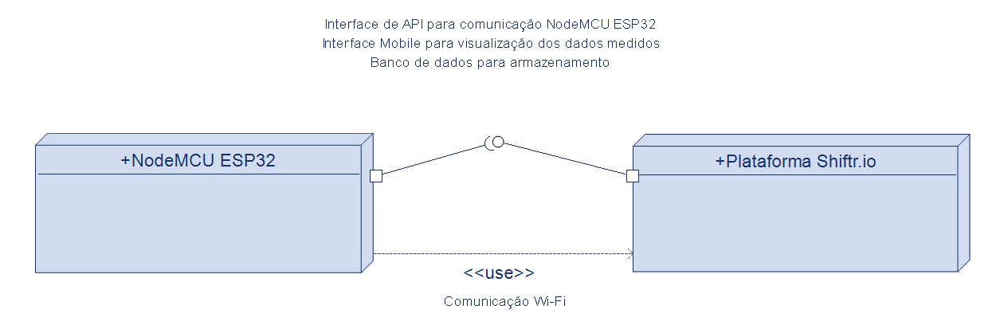

# UML CloudWatch

Este projeto apresenta um protótipo desenvolvido com base em **diagramas UML**, que ilustram os principais componentes e fluxos do sistema.

## Arquitetura do Projeto

### NodeMCU ESP32
O **NodeMCU ESP32** é responsável por:
- Interpretar as informações do **sensor de temperatura**.  
- Transmitir os dados coletados para a plataforma **Shiftr.io**.  

### Plataforma Shiftr.io
A **Plataforma Shiftr.io** é projetada para facilitar a conexão e gestão de dispositivos na **Internet das Coisas (IoT)**.  
Ela oferece serviços de nuvem e aplicativos de desktop que permitem a rápida integração de hardware e software, utilizando os protocolos **MQTT** e **HTTP** para publicação, inscrição e recuperação de mensagens.  

### Conexão entre NodeMCU ESP32 e Shiftr.io
O envio dos dados de temperatura é feito em 5 etapas:  
1. Configuração da conexão de rede no ESP32 (Wi-Fi).  
2. Leitura dos dados do sensor de temperatura pelo ESP32.  
3. Envio dos dados para o Shiftr.io usando a **API** (HTTP ou MQTT).  
4. O Shiftr.io recebe os dados e os armazena em seu servidor.  
5. Os dados ficam disponíveis em tempo real na plataforma Shiftr.io.  

---

## Diagramas UML

### Diagrama de Casos de Uso

### Diagrama de Componentes

---

## Como Abrir e Editar os Diagramas UML

Seguindo estas instruções, será possível abrir, editar e exportar os diagramas UML localmente utilizando o **Modelio**.

🔧 Passo 1: Instalar o Modelio  
Baixe e instale o **Modelio** a partir do site oficial:  
https://www.modelio.org/download/

📂 Passo 2: Abrir o Projeto  
No Modelio, vá em **File > Open Project** e selecione a pasta `diagrams/` deste repositório, onde estão armazenados os arquivos do projeto UML.

🖼️ Passo 3: Visualizar os Diagramas  
No painel do Modelio, navegue até os diagramas disponíveis (Casos de Uso, Componentes, etc.) e abra clicando duas vezes.

✏️ Passo 4: Editar os Diagramas  
Realize as alterações necessárias diretamente no Modelio.  
É possível adicionar, remover ou modificar elementos UML de acordo com a evolução do projeto.

💾 Passo 5: Exportar para Imagem  
Após editar, exporte novamente os diagramas em formato `.png`:  
- Clique com o botão direito no diagrama  
- Selecione **Export Diagram As Image**  
- Salve o arquivo dentro da pasta `images/` para manter o repositório atualizado.  

